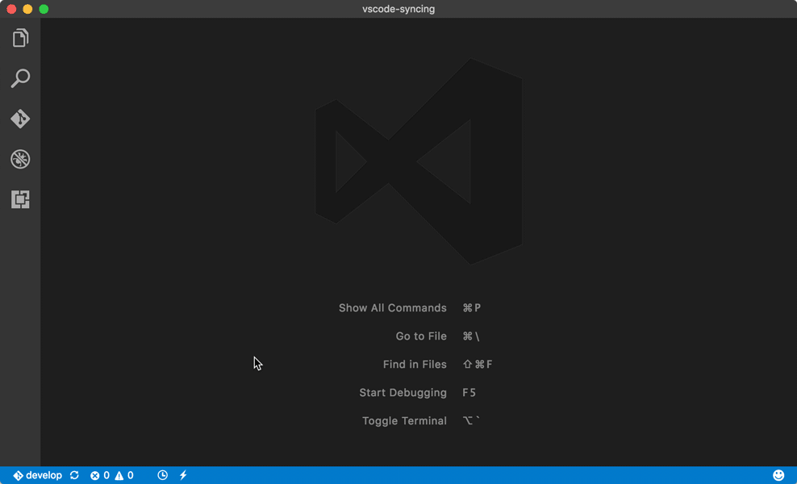
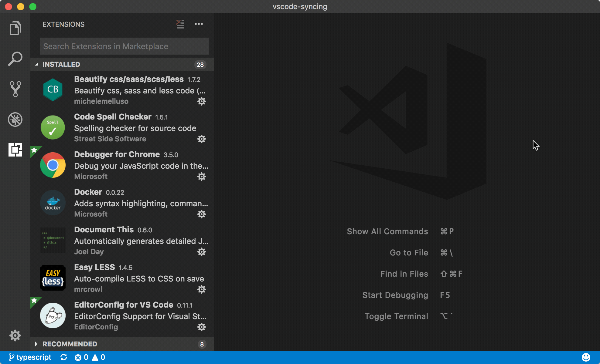

# Syncing

[](https://marketplace.visualstudio.com/items?itemName=nonoroazoro.syncing)
[](https://marketplace.visualstudio.com/items?itemName=nonoroazoro.syncing)
[](https://marketplace.visualstudio.com/items?itemName=nonoroazoro.syncing#review-details)

[English](README.md) | [中文](README.zh-CN.md)

**Syncing** *([View Source Code](https://github.com/nonoroazoro/vscode-syncing))* is a VSCode extension, designed to **synchronize all of your VSCode settings across multiple devices** with GitHub Gist.

[Getting started](#getting-started) or [check out the examples](#examples).

> *Keep it simple & reliable!*


## Breaking Changes

* From ***version 1.8.0*** onwards:

    1. **You can exclude VSCode extensions from being synchronized.**

    1. **`Syncing` will now automatically update your extensions during the synchronization.**

    1. **In addition, I've changed some settings of `Syncing` to improve the scalability.**

    > Please [check out the VSCode User Settings](#vscode-user-settings) for more details.


## Features

*Syncing* will `keep the consistency of your VSCode settings between your devices`, it'll let you:

1. **Upload VSCode Settings**:

    * It will upload the `settings, keybindings, extensions, locales` and `snippets`.
    * The `keybindings` of `Macintosh` and `non-Macintosh` will be synchronized separately, in case you have multiple devices.
    * Automatically create a new Gist to store your settings.
    * Use an incremental algorithm to boost the synchronization.
    * You can `exclude some VSCode User Settings` from being uploaded, [check out the VSCode User Settings](#vscode-user-settings) for more details.

1. **Download VSCode Settings**:

    * **Always overwrite** local settings.
    * Automatically `install, update` and `remove` extensions.
    * You can download settings from `a public Gist`, such as your friend's VSCode settings, [check out here](#getting-started) for more details.
    * You can `exclude some VSCode User Settings` from being downloaded, [check out the VSCode User Settings](#vscode-user-settings) for more details.

Besides, you can [set up a proxy](#proxy-settings) to accelerate the synchronization. And of course, you'll have a `progress indicator` during the synchronization :).


## Commands

You can type `"upload"`, `"download"` (or `"syncing"`) in `VSCode Command Palette` to access these commands:

1. ***`Syncing: Upload Settings`***

    > Upload settings to GitHub Gist.

1. ***`Syncing: Download Settings`***

    > Download settings from GitHub Gist.

1. ***`Syncing: Open Syncing Settings`***

    > Set your `GitHub Personal Access Token`, `Gist ID` or `HTTP Proxy` settings.


## Keybindings

The keybindings **are unassigned by default**, but you can easily turn them on by updating `VSCode Keyboard Shortcuts`:

1. For VSCode versions >= 1.11 (***recommended***):

    

1. For VSCode versions < 1.11, for example:

    ```json
    {
        "key": "alt+cmd+u",
        "command": "syncing.uploadSettings"
    },
    {
        "key": "alt+cmd+d",
        "command": "syncing.downloadSettings"
    },
    {
        "key": "alt+cmd+s",
        "command": "syncing.openSettings"
    }
    ```


## VSCode User Settings

You can find the following `Syncing Settings` in your `VSCode User Settings`.

1. ***`syncing.excludedExtensions`***

    You can configure [glob patterns](https://github.com/isaacs/minimatch) for excluding some `VSCode Extensions` from being synchronized.

    > Note that the extensions not listed here will still be synchronized.

    Take this for example:

    ```json
    "syncing.excludedExtensions" : [
        "somepublisher.*",
        "nonoroazoro.syncing"
    ]
    ```

    Note that the excluded `extension name` is actually the `extension id` (you can find it in the `VSCode Extensions View`), such as:

    

    Now the extension `nonoroazoro.syncing` (i.e., `Syncing`) and all the extensions of the author `somepublisher` will no longer be synchronized.

1. ***`syncing.excludedSettings`*** *(Formerly `syncing.upload.exclude`)*

    You can configure [glob patterns](https://github.com/isaacs/minimatch) for excluding some `VSCode User Settings` from being synchronized.

    > Note that the settings not listed here will still be synchronized.

    Take this for example:

    ```json
    "syncing.excludedSettings" : [
        "editor.*",
        "workbench.colorTheme"
    ]
    ```

    Now the `workbench.colorTheme` setting and all the settings of `editor` will no longer be synchronized.

1. ***`syncing.extensions.autoUpdate`***

    You can configure this setting to let `Syncing` automatically update your extensions during the synchronization.

    This is `enabled by default` but you can turn it off in your `VSCode User Settings`.

1. ***`syncing.pokaYokeThreshold`***

    During the synchronization, `Syncing` will check the changes between your local and remote settings, and display a `confirm dialog` if the changes exceed this threshold.

    The `default value` of this setting is `10`, and you can `disable this feature` by setting to a number `less than or equal to zero` (`<= 0`).

    Take this for example:

    ```json
    "syncing.pokaYokeThreshold" : 10
    ```


## Proxy Settings

You can set up a proxy to accelerate the synchronization. Here are the steps:

1. Type `"Syncing: Open Syncing Settings"` (or just `"opensync"`) in `VSCode Command Palette` to open `Syncing`'s own settings file (i.e. `syncing.json`).

1. Change the `"http_proxy"` setting (From ***version 1.5.0*** onwards, `Syncing` will no longer read `http.proxy` from `VSCode User Settings`), for example:

    ```json
    "http_proxy": "http://127.0.0.1:1080"
    ```

Moreover, if you don't set `"http_proxy"`, `Syncing` will try to use the `http_proxy` and `https_proxy` environment variables.

> Please note that unlike the settings in [VSCode User Settings](#vscode-user-settings), `Syncing` **will not upload** its own settings file because it contains your personal information.


## Getting Started

1. Get your own `GitHub Personal Access Token` (3 steps).

    1. Login to your **[GitHub Personal Access Tokens page](https://github.com/settings/tokens)** and click **`Generate new token`**.

        

    1. Give your token a descriptive **`name`**, check **`gist`** and click **`Generate token`**.

        

    1. **`Copy`** and **`backup`** your token.

        

1. Sync your VSCode settings.

    *`Syncing`* will ask for necessary information `for the first time` and `save for later use`.

    1. **Upload**

        1. Type `upload` in `VSCode Command Palette`.

            

        1. Enter your `GitHub Personal Access Token`.

        1. Select or enter your `Gist ID`.

            > You can `leave it blank` to create a new `Gist` automatically.

        1. Done!

        1. *After it's done, you can find the settings and the corresponding `Gist ID` in your [GitHub Gist](https://gist.github.com). Also, you can `Edit` and `make it public` to share your settings with others.*

    1. **Download**

        1. Type `download` in `VSCode Command Palette`.

            

        1. Enter your `GitHub Personal Access Token`.

            > You can `leave it blank` if you want to download from a `public Gist`, such as your friend's VSCode settings.

        1. Select or enter your `Gist ID` or a `public Gist ID`.

        1. Done!


## Examples

1. Upload:

    

1. Download:

    
